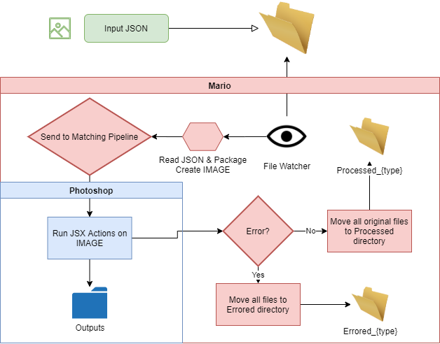

# Mario

## The Stack

- [Vue](https://vuejs.org/) as JS framework
- Hot Reloading (panel updates instantly on every save during `npm run serve`)
- [Vue-CLI-3](https://cli.vuejs.org/) as Node.js tooling (webkit)
- Various utility components that handle context/flyout menus, launching CEF debug, common errors with Webpack
- Modern JS (CS6)

For a full list of packages utilized, see the package.json 

***NOTE*** Conscious effort was made to minimize the number of 3rd party libraries used in order to maintain performance and ease of debugging.

---

## Commands

This panel comes with 5 commands baked in ([see details here](https://github.com/Inventsable/CEP-Self-Signing-Panel#what-do-they-do)):

- `npm run help` - A full list of the commands available and descriptions.
- `npm run switch` - Reports whether in developer or production context and can switch automatically.
- `npm run update` - Reports current version of panel in manifest and prompts to update Major, Minor, or Micro.
- `npm run register` - Reports the current user data (if any) and prompts to save new info to be used in certificates.
- `npm run sign` - Automatically stages and signs the extension, placing it in a `./archive` directory within the current panel.
- `npm run serve` - For development. Enables hot reloading.


## Contexts

You can automate this by using `npm run switch`. In case you need to do it manually:

### For development

- Ensure `index-dev.html` is uncommented in `CSXS/manifest.xml`. Use `npm run switch`. 

```xml
  <Resources>
    <MainPath>./public/index-dev.html</MainPath>
    <!-- <MainPath>./dist/index.html</MainPath> -->
    <ScriptPath>./public/index.jsx</ScriptPath>
    <!-- <ScriptPath>./dist/index.jsx</ScriptPath> -->
```

- Restart Photoshop (Any changes to manifest.xml require a restart).
- Run `npm run serve` in the terminal at the project root
- Launch host application and find in Window > Extensions
- Panel now updates in real time and recompiles every time you save in VSCode

### For production

- Ensure `dist/index.html` is uncommented in `CSXS/manifest.xml`

```xml
  <Resources>
    <!-- <MainPath>./public/index-dev.html</MainPath> -->
    <MainPath>./dist/index.html</MainPath>
    <!-- <ScriptPath>./public/index.jsx</ScriptPath> -->
    <ScriptPath>./dist/index.jsx</ScriptPath> 
```

- Run `npm run build` in the terminal at the project root
- Launch host application and find in Window > Extensions
- Panel is now ready to sign and certify or be used on any client

---

## Getting Started

Its easiest to develop if you add a symbolic link to:
*C:/Users/<user>/AppData/Roaming/Adobe/CEP/extensions*  (this is the path on Windows and may change depending on version of Photoshop)
and point it to the git repository directory for this project.

NOTE: Photoshop will need restarted in order to find new plugins added to the extensions directory. 

1. git clone http://g1vptfs02:8080/tfs/FMG/Web/_git/web-mario
2. mklink /D C:/Users/<user>/AppData/Roaming/Adobe/CEP/extensions/web-mario C:/Projects/web-mario  (Windows)
3. cd web-mario 
4. npm install 
5. npm run serve 
6. Open Photoshop. Open Mario panel via Window > Extensions > Mario 
7. Open a Chrome tab and visit http://localhost:8089/ if you wish to develop
8. Do awesome things. Add solutions to any encountered issues to this Readme

---

## Resources 

[2019 Adobe CC Scripting Guide](https://www.adobe.com/content/dam/acom/en/devnet/photoshop/pdfs/photoshop-cc-scripting-guide-2019.pdf)
[Adobe CC JS Scripting Reference](https://www.adobe.com/content/dam/acom/en/devnet/photoshop/pdfs/photoshop-cc-javascript-ref-2019.pdf)
[Adobe CC Extension SDK Reference](http://wwwimages.adobe.com/content/dam/acom/en/devnet/cs-extension-builder/pdfs/CC_Extension_SDK.pdf)
[Adobe CEP 9 HTML Extension Cookbook](https://github.com/Adobe-CEP/CEP-Resources/tree/master/CEP_9.x/Documentation)

Also find this super helpful reference **Javascript Tools Guide CC.pdf**
You might find this at *C:/Program Files (x86)/Adobe/Adobe ExtensionScript Toolkit CC/SDK*

[Great post on modifying data in child components](https://antenna.io/blog/2018/01/state-management-in-vue-js/)


---

## Components

<br>&nbsp;&nbsp;|\_\_&nbsp;:page_facing_up: app.vue (main `route`)
:file_folder: ./src/components
<br>&nbsp;&nbsp;&nbsp;&nbsp;&nbsp;&nbsp;&nbsp;&nbsp;&nbsp;|\_\_&nbsp;:page_facing_up: jsx.vue 
<br>&nbsp;&nbsp;&nbsp;&nbsp;&nbsp;&nbsp;&nbsp;&nbsp;&nbsp;&nbsp;&nbsp;&nbsp;&nbsp;&nbsp;&nbsp;&nbsp; • Adobe JSX tab with helpful tools for testing/translating Extendscript code
<br>&nbsp;&nbsp;&nbsp;&nbsp;&nbsp;&nbsp;&nbsp;&nbsp;&nbsp;|\_\_&nbsp;:page_facing_up: console.vue
<br>&nbsp;&nbsp;&nbsp;&nbsp;&nbsp;&nbsp;&nbsp;&nbsp;&nbsp;&nbsp;&nbsp;&nbsp;&nbsp;&nbsp;&nbsp;&nbsp; • a convenience view for console logs, including exceptions
<br>&nbsp;&nbsp;&nbsp;&nbsp;&nbsp;&nbsp;&nbsp;&nbsp;&nbsp;|\_\_&nbsp;:page_facing_up: configurator.vue
<br>&nbsp;&nbsp;&nbsp;&nbsp;&nbsp;&nbsp;&nbsp;&nbsp;&nbsp;&nbsp;&nbsp;&nbsp;&nbsp;&nbsp;&nbsp;&nbsp; • app configuration tab, including folder watchers
<br>&nbsp;&nbsp;&nbsp;&nbsp;&nbsp;&nbsp;&nbsp;&nbsp;&nbsp;|\_\_&nbsp;:page_facing_up: pipelines.vue
<br>&nbsp;&nbsp;&nbsp;&nbsp;&nbsp;&nbsp;&nbsp;&nbsp;&nbsp;&nbsp;&nbsp;&nbsp;&nbsp;&nbsp;&nbsp;&nbsp; • tab for viewing/editing pipeline configurations

---

## Files

General files/folders you should be aware of:

:file_folder: mario
<br>&nbsp;&nbsp;|\_\_&nbsp;:file_folder: CSXS
<br>&nbsp;&nbsp;&nbsp;&nbsp;&nbsp;&nbsp;&nbsp;&nbsp;&nbsp;|\_\_&nbsp;:page_facing_up: manifest.xml (the primary configuration file for adobe extensions)
<br>&nbsp;&nbsp;&nbsp;&nbsp;&nbsp;&nbsp;&nbsp;&nbsp;&nbsp;&nbsp; • Changes have been made to include node context. See the README in `./CSXS`
<br>&nbsp;&nbsp;|\_\_&nbsp;:file_folder: public
<br>&nbsp;&nbsp;&nbsp;&nbsp;&nbsp;&nbsp;&nbsp;&nbsp;&nbsp;&nbsp; • Any files/folders contained here will be automatically bundled in `./dist/` after `npm run build`
<br>&nbsp;&nbsp;&nbsp;&nbsp;&nbsp;&nbsp;&nbsp;&nbsp;&nbsp;&nbsp; • You can include any assets (.pngs, scripts, etc) here or `src` for use in the panel
<br>&nbsp;&nbsp;&nbsp;&nbsp;&nbsp;&nbsp;&nbsp;&nbsp;&nbsp;|\_\_&nbsp;:page_facing_up: CSInterface.js (Adobe CEP extension development library, for events, jsx execution, etc)
<br>&nbsp;&nbsp;&nbsp;&nbsp;&nbsp;&nbsp;&nbsp;&nbsp;&nbsp;|\_\_&nbsp;:page_facing_up: index.html (**Production:** used with `npm run build`)
<br>&nbsp;&nbsp;&nbsp;&nbsp;&nbsp;&nbsp;&nbsp;&nbsp;&nbsp;|\_\_&nbsp;:page_facing_up: index-dev.html (**Development:** used with `npm run serve`)
<br>&nbsp;&nbsp;&nbsp;&nbsp;&nbsp;&nbsp;&nbsp;&nbsp;&nbsp;|\_\_&nbsp;:page_facing_up: index.jsx (Important JSX functions)
<br>&nbsp;&nbsp;&nbsp;&nbsp;&nbsp;&nbsp;&nbsp;&nbsp;&nbsp;|\_\_&nbsp;:page_facing_up: polyfill.jsx (Typical JS polyfills for the Extendscript environment. Currently the Adobe jsx engine is built on an old version of the JS standard. Many functions such as Array.prototype.forEach 
are not available. If any standard function is not available, a polyfil can often be added to the 
at /public/polyfil.jsx which is imported when Mario is opened. )
<br>&nbsp;&nbsp;&nbsp;&nbsp;&nbsp;&nbsp;&nbsp;&nbsp;&nbsp;|\_\_&nbsp;:page_facing_up: utils.jsx (Convenient Extendscript functions for Action development. These are made available on the global underscore _  object. For example, string templating functions or geometry calculations.)
<br>&nbsp;&nbsp;|\_\_&nbsp;:file_folder: src
<br>&nbsp;&nbsp;&nbsp;&nbsp;&nbsp;&nbsp;&nbsp;&nbsp;&nbsp;&nbsp; • This is your development folder, you can place any number of components or files here
<br>&nbsp;&nbsp;&nbsp;&nbsp;&nbsp;&nbsp;&nbsp;&nbsp;&nbsp;|\_\_&nbsp;:file_folder: components
<br>&nbsp;&nbsp;&nbsp;&nbsp;&nbsp;&nbsp;&nbsp;&nbsp;&nbsp;|\_\_&nbsp;:page_facing_up: app.vue
<br>&nbsp;&nbsp;&nbsp;&nbsp;&nbsp;&nbsp;&nbsp;&nbsp;&nbsp;&nbsp;&nbsp;&nbsp;&nbsp;&nbsp;&nbsp;&nbsp;&nbsp;&nbsp;&nbsp;&nbsp;&nbsp;&nbsp;&nbsp; • This is the **main entry point** for the extension panel
<br>&nbsp;&nbsp;&nbsp;&nbsp;&nbsp;&nbsp;&nbsp;&nbsp;&nbsp;&nbsp;&nbsp;&nbsp;&nbsp;&nbsp;&nbsp;&nbsp; • You cannot change this from a `<div>` of `#app`. Add your own components inside it instead of modifying it directly.
<br>&nbsp;&nbsp;&nbsp;&nbsp;&nbsp;&nbsp;&nbsp;&nbsp;&nbsp;|\_\_&nbsp;:page_facing_up: main.js
<br>&nbsp;&nbsp;&nbsp;&nbsp;&nbsp;&nbsp;&nbsp;&nbsp;&nbsp;&nbsp;&nbsp;&nbsp;&nbsp;&nbsp;&nbsp;&nbsp; • The main js entry point. This is where the main Vue instance is setup. 


--- 

## How Mario Works




--- 

## Glossary & Conventions

### IMAGE 

Refers to an image ready for processing/being processed. Pipelines dont require a 
working/starter image but in general either a working 'image' or a 'package' will be provided. 
<br> For the current IMAGE in process, an instance of ImageForProcessing class is assigned to 
the global 'IMAGE' variable on the jsx side. This object contains any data from **json**, as 
well as the 'image' path, and 'package' path.

***Working Image*** Generally the image that is opened at the start of a pipeline. 

This can either be either: 
* a file created deliberately by a pipeline action 
* a file opened deliberately by a pipeline action. Such as the one given by the 'image' path property in the JSON. 
* an image file that was dropped into a watch folder which watches for images (not json) 

***Package*** A directory containing image(s) required by a pipeline for processing. 
<br>Specified as the 'package' property in the JSON.


***NOTE*** private variables start with an underscore _  and should not be modified/accessed by actions. 

<u>Available properties</u> are as follows:
- None 

<u>Available methods</u> are:
- getType() returns the 'type' of the image being processed 
- getImagePath() returns the image path given by 'image' in the json 
- getPackagePath() returns the package path given by 'package' in the json 
- data() getter for retreiving json data properties. 
- hasKeyword() can be used to check if a keyword exists in the 'imagePath' XMP metadata 
- context() can be used to get or set context variables required by other actions in the pipeline 
- parameters() fills in mustache template strings {{ key }} data by the key 


### Input JSON 

Optional json file. 
*NOTE:* One json file is expected per **IMAGE** process. If there are multiple images needed for a process 
    (such as when 'package' is defined) than any data needed for these should be listed in the 
    single json file, such as in an array of objects. 

Contains data needed for a pipeline in order for a particular IMAGE to be processed. 
***type*** - (optional) the type indicating the pipeline(s) that will process the IMAGE. **This must match a pipeline type.**
***image*** - (optional) a path to the Working Image used in the pipeline. Generally opened at the very start. 
***package*** - (optional) a path to the Package folder containing other images used by the pipeline. 
*NOTE:* As a convention, any other paths in the json data will be expected to be relative to the **package** path

All other data will be made available on the IMAGE instance on the photoshop jsx side. 
Or said another way, Mario ALWAYS looks for the 'type', 'image', and 'package' properties.
All other properties in the json are only used by JSX actions. 


### Input Methods

REST:
- Currently the REST api is not setup to stream images/data for processing  (See Roadmap)

File Watching:
- Mario can be configured to watch specific directories for new images to process. 
  (Files in subdirectories are ignored by the watcher.)
  There are two options:
    1. Watch for json files 
    See **Input JSON** for info on image paths necessary for processing.
    2. Watch for images 
    Looks for json file containing data by the same name as the image. Ok if none found.  


### Pipeline

A configurable series of JSX actions to be performed on an IMAGE. 
Pipelines are configurable via Mario's UI. 

**NOTE** Currently only linear configurations can be created via the UI. For pipelines requiring loops, 
or other types of control flow, a custom action is necessary. 
Actions may call other actions from within themselves. 
(See Roadmap)

- A Pipeline can be thought of as generating as 'single' output file, and this is a good convention 
to follow to avoid overly complex pipeline configurations. 


### Action

Extendscript code that will be executed (Example, adding a background color, or resizing a document)

- Actions that have *no business specific logic or data references* will be defined in the 
  root /actions directory. For example, action.saveDocument() which just saves the active document. 
  These types of actions can be thought of as 'Augmenting' Photoshop functionality which isnt availble 
  via their existing jsx API. For example, adding a drop shadow to a layer. 
- Business specific actions should be defined in other subdirectories. 
  Its recommended that actions specific to a particular Pipeline should be defined in a 
  subdirectory by that Pipeline name. 
- Actions MUST have the same name and casing as their functions. 
- Actions are defined in the directory /public/actions (See Roadmap)
- Only one action is defined per .jsx file 
- Actions within the root /public/actions directory are defined on the 'action' namespace

    Actions within other subdirectories are defined on the namespace corresponding to the folder structure. 
    For example, an action at /public/actions/foo/bar.jsx  will be defined as foo.bar = function bar(){...}; 
- Action arguments can either receive a single primitive value (Number, String, etc), or an options object with key/value pairs. 


### Outputs 

IMAGEs which are successfully processed will be moved into a processed directory (Processed_<type>) inside the watched directory which initiated the process.


### Logging 

If an exception occurs in the JSX while a pipeline is running, the current IMAGE (including anything at 'image' or 'package') 
will be moved within an error directory (Error_<type>) inside the watched directory which initiated the process. 
An error message describing the exception will also be logged within the directory. 


---

## Roadmap 

- Add [Rete.js](https://rete.js.org/) visual node based editor for more powerful editing of pipeline logic / flow via the GUI. 
- Parse jsx action JSDoc comments and use data in building existing action selection interface in the UI. 
- Sync git version tags with manifest.xml 
- Expand REST API to support remote image processing
- Move actions out extension package and into an external, configurable directory. This would allow the Extendscript actions to be shared by other Panels.

---

## Common errors:

### require is not a function/defined

- If wanting to use `require()` or `process` in both Developer and Production, you need to assign them manually in each .vue file (due to being nested in an iframe) like so:

```js
const require = cep_node.require || require;
const fs = require("fs"); // Now available in both
```

### Panel is not updating

- Adding or reorganizing components may cause hot reloading to fail. Many times you will be warned of this in `CEF debug`'s console, fix this by hitting `^C` in your active terminal to `Terminae batch job`, then run `npm run serve` once more and refresh the panel.

### Page Not Found (cannot find page at `localhost:####` displays in panel)

- Must run `npm run serve` and have the `App running at: -Local / -Network` message in your terminal
- If you launched the app before running `npm run serve`, click the localhost URL inside the panel's error message

### Panel is white or blank

- Check your CEF client via `localhost:####` for an error thrown in your code which breaks the panel's rendering
- If in `Production` context and receiving `404` errors in your `index.html`, ensure your `dist/index.html`'s script tags have `src` attributes such as `src=./filepath` or `src=filepath` instead of `src=/filepath` (leading slash is default but will break, should be fixed via `vue.config.js`)

### Sign/Certify is failing

- Including hidden files and repositories in your ZXP/ZIP will cause a misleading error message. Be sure to delete hidden items such as `node_modules/`, `.git/`, and any other hidden files/folders prior to your sign/certify.

### Certificate signing errors. 

- You may encounter invalid signature errors when attempting to run the extension in development mode in Photosohop. <br>Try the following command to disable signature checking (NOTE: 9 Corresponds to CC 2019. Change the number if necessary.) 
> `defaults write com.adobe.CSXS.9 PlayerDebugMode 1`

